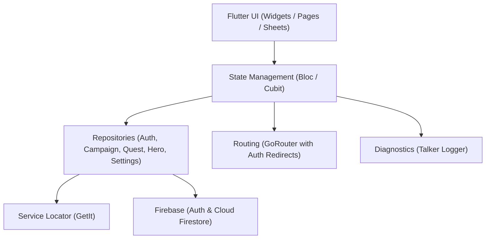

# ⚔️ Quest Board

<div align="center">

[](https://flutter.dev)
[](https://dart.dev)
[](https://firebase.google.com)
[](https://github.com)
[](LICENSE)

<p align="center">
  <b>A modern collaborative tabletop RPG campaign and quest management companion app built with Flutter and Firebase.</b>
</p>

</div>

---

## 📖 Overview

**Quest Board** is designed for Game Masters and tabletop RPG players (D&D, Pathfinder, and custom homebrew worlds). It streamlines campaign organization, player management, quest logs, and party rosters—all synchronized in real-time. 

With custom world calendar support, Game Masters can craft unique in-game calendars with custom months and weekdays, tracking quests and party timelines seamlessly.

---

## ✨ Key Features

- 🏰 **Campaign Management**
  - Create and manage multiple tabletop campaigns as a Game Master or Player.
  - Effortless party invitations via **QR code scanning** (`mobile_scanner`) or shareable invite codes.
  - Manage active player lists and campaign ownership permissions.

- 🗓️ **Custom Fantasy Calendars**
  - Define custom world calendars tailored to any fantasy universe.
  - Support for arbitrary month lengths, custom names, and unique days of the week.
  - Interactive calendar surface visualizing single-day and multi-day quests across months.

- 📜 **Quest Tracking**
  - Log, assign, and track quests with deadlines, status, and descriptions.
  - Visual calendar badges showing quest scheduling and multi-day expedition timelines.

- 🛡️ **Hero & Party Roster**
  - Keep track of party members, character classes, and player assignments.
  - Dedicated character management view per campaign.

- 🔒 **Security & Authentication**
  - Firebase Authentication (Email/Password) with secure session handling.
  - Granular Firestore security rules ensuring private profiles and owner-only campaign mutations.
  - Full in-app **Account Deletion** with automated cascading cleanup of owned campaigns, quests, heroes, and invite codes.

- 🌓 **Themes & UI**
  - Elegant Material 3 Dark and Light themes with persistent preferences.
  - Clean and responsive design optimized for mobile screens.

---

## 🏗️ Architecture & Tech Stack



| Layer | Library / Tool | Description |
|---|---|---|
| **Framework** | [Flutter](https://flutter.dev) | Cross-platform UI toolkit |
| **State Management** | [`flutter_bloc`](https://pub.dev/packages/flutter_bloc) | Predictable BLoC & Cubit pattern |
| **Dependency Injection** | [`get_it`](https://pub.dev/packages/get_it) | Fast service locator |
| **Navigation** | [`go_router`](https://pub.dev/packages/go_router) | Declarative routing & auth redirects |
| **Backend & Cloud** | [`firebase_auth`](https://pub.dev/packages/firebase_auth), [`cloud_firestore`](https://pub.dev/packages/cloud_firestore) | Authentication & real-time database |
| **QR Code Engine** | [`qr_flutter`](https://pub.dev/packages/qr_flutter), [`mobile_scanner`](https://pub.dev/packages/mobile_scanner) | Generation & camera scanning |
| **Logging** | [`talker_flutter`](https://pub.dev/packages/talker_flutter) | Structured logging & error inspection |

---

## 📂 Project Structure

```text
lib/
├── auth/                    # Authentication feature (Login, Register, AppUser, AuthBloc, AuthRepo)
│   ├── bloc/                # AuthBloc events and states
│   ├── data/                # User models and authentication repositories
│   └── view/                # Login and Registration pages
├── campaign_detail/         # Campaign detail view (Calendar & Heroes roster)
│   ├── cubit/               # CampaignDetailCubit and state
│   ├── data/                # Models (Quest, Hero) and repositories
│   └── view/                # Calendar page, Heroes page, and interactive widgets
├── campaign_list/           # Main campaign dashboard (Owned & Joined campaigns)
│   ├── cubit/               # CampaignListCubit, CreateCampaignCubit, JoinCampaignCubit
│   ├── data/                # Models (Campaign, CustomMonth, DayOfWeek) and repository
│   └── view/                # CampaignListPage, bottom sheets, and cards
├── settings/                # User & app settings
│   ├── cubit/               # ThemeCubit
│   ├── data/                # Settings repository (SharedPreferences)
│   └── view/                # SettingsPage (Theme switch, Account deletion)
├── theme/                   # Material 3 light and dark theme definitions
├── firebase_options.dart    # FlutterFire generated configuration
├── main.dart                # App entrypoint and DI registrations
└── router.dart              # GoRouter configuration and auth guards
```

---

## 🚀 Getting Started

### Prerequisites

- **Flutter SDK**: `^3.47.0` (Dart `^3.13.0`)
- **Android Studio** or **VS Code** with Flutter extensions
- **Firebase Project**: Configured with Authentication (Email/Password) and Cloud Firestore

### 1. Clone the repository

```bash
git clone https://github.com/nikklaud/QuestBoard.git
cd QuestBoard
```

### 2. Install dependencies

```bash
flutter pub get
```

### 3. Firebase Configuration

If you want to connect your own Firebase instance:
1. Install [FlutterFire CLI](https://firebase.flutter.dev/docs/cli/):
   ```bash
   dart pub global activate flutterfire_cli
   ```
2. Run configuration:
   ```bash
   flutterfire configure
   ```
3. Deploy Firestore security rules:
   ```bash
   firebase deploy --only firestore:rules
   ```

### 4. Run the application

```bash
# Run in debug mode on connected device / emulator
flutter run

# Run on Android with specific flavor/release
flutter run --release
```

---

## 🧪 Testing & Code Quality

The project includes unit tests for calendar algorithms and model parsing, as well as widget tests for user flows:

```bash
# Run all unit and widget tests
flutter test

# Run static analysis (linter)
flutter analyze

# Format codebase according to Dart style guide
dart format .
```

---

## 🤖 Continuous Integration

Automated testing is configured via **GitHub Actions** ([`.github/workflows/test.yml`](.github/workflows/test.yml)).

Every commit and pull request runs:
1. **Dependency check:** `flutter pub get`
2. **Formatting verification:** `dart format --output=none --set-exit-if-changed .`
3. **Static analysis:** `flutter analyze`
4. **Test suite:** `flutter test`

---

## 📜 License

This project is open-source and available under the [MIT License](LICENSE).
